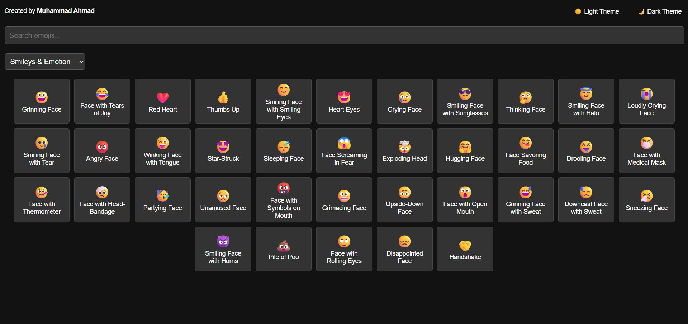

# 😀 Angular Emoji Search App

A fast, clean, and responsive emoji search application built using **Angular 19**, **SCSS**, and a **service-driven architecture**. Includes category-based filtering, instant search, and a clipboard copy feature — plus a **light/dark theme picker**.

---

## 🌐 Live Demo

👉 [Click here to use the app](https://ahmad-889.github.io/emoji-search/)


---

## 🎯 What I Built


This application is structured with **standalone components** for maintainability and scalability.  
Here’s what’s inside:

* ✅ `EmojiSearchComponent`: Search, filter, and display emojis with category support  
* ✅ `EmojiService`: Loads emoji data and extracts category lists  
* ✅ `ThemePickerComponent`: Switch between **light** and **dark** themes instantly  
* ✅ Clipboard copy functionality with **copy confirmation toast**  

---

## 💡 Key Features

* 🔍 **Search emojis** by name in real-time  
* 🗂️ **Filter emojis** by category  
* 📋 **Copy emoji** to clipboard with one click  
* 🎨 **Light/Dark theme toggle** for personalized UI  
* 📱 Fully responsive design  
* ⚡ Fast performance with local JSON data source  


---

## 🧱 Technologies Used

* Angular 19 (Standalone Components)
* TypeScript
* SCSS (Custom styling + Responsive Design)
* RxJS + Angular HTTPClient
* Local JSON data for emoji storage

---

## 📸 Screenshot



---

## 📁 Project Structure

```
src/
└── app/
├── components/
│ ├── emoji-search/
│ │ ├── emoji-search.component.ts   # Component logic
│ │ ├── emoji-search.component.html # UI template
│ │ └── emoji-search.component.scss # Styling
│ └── theme-picker/
│ ├── theme-picker.component.ts     # Theme toggle logic
│ ├── theme-picker.component.html   # Theme toggle UI
│ └── theme-picker.component.scss   # Theme styling
├── services/
│ └── emoji.service.ts              # Emoji data service
└── models/
└── emoji.model.ts                  # Emoji interface
```

## 🚀 Running the Project

Install Angular CLI if you haven't:

```bash
npm install -g @angular/cli
```

Install dependencies and serve:

```bash
npm install
ng serve
```

Visit `http://localhost:4200` to see the custom directives in action.

---

## 🔗 Author
Made with ❤️ by
Muhammad Ahmad


